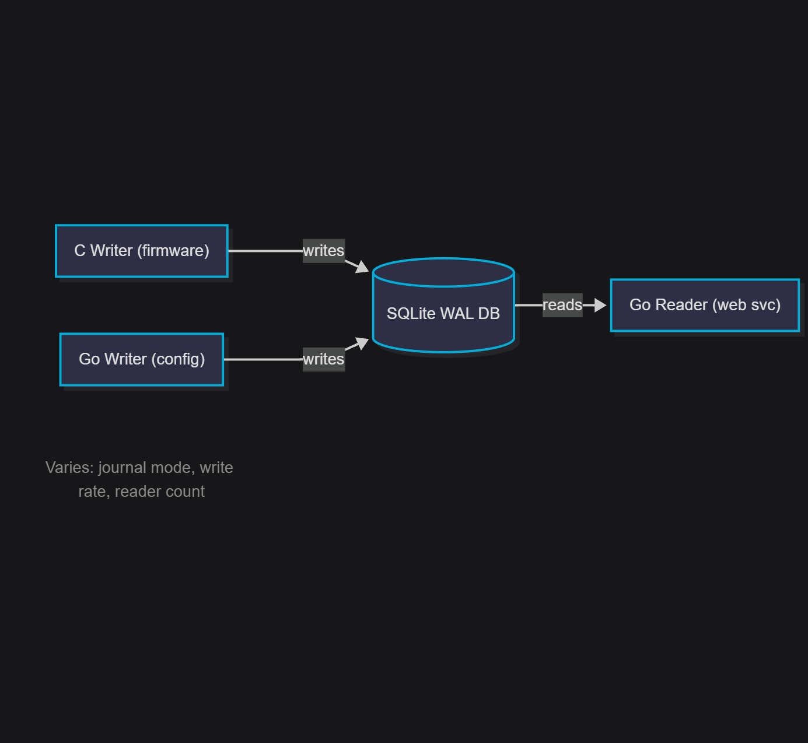
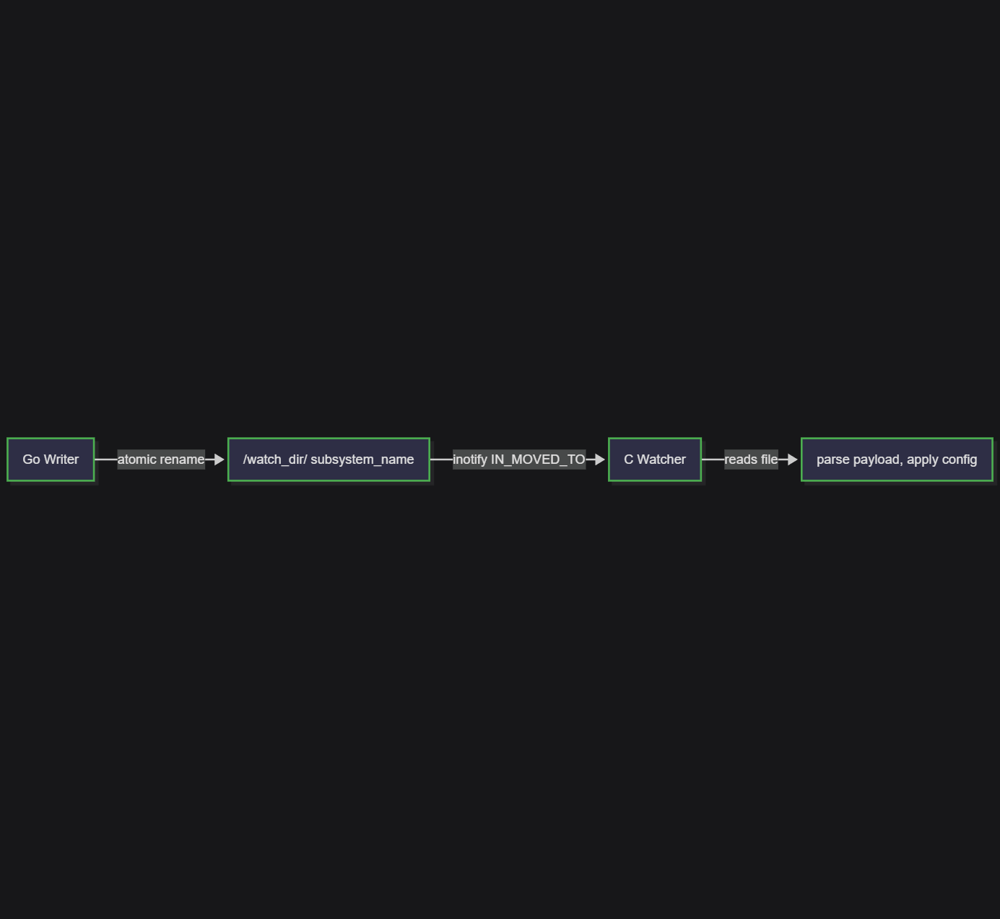
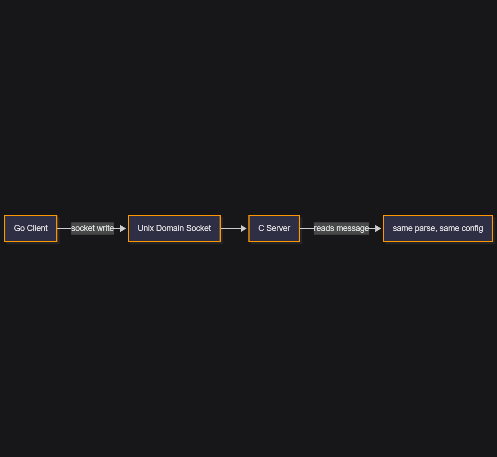
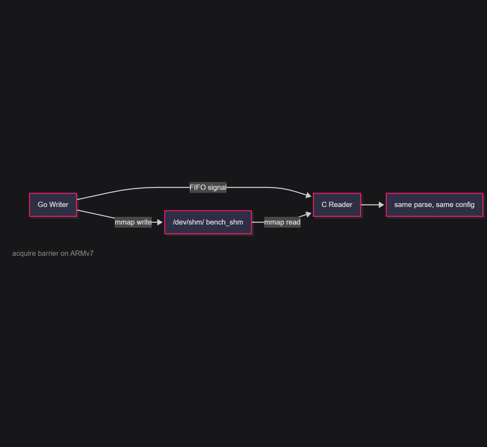
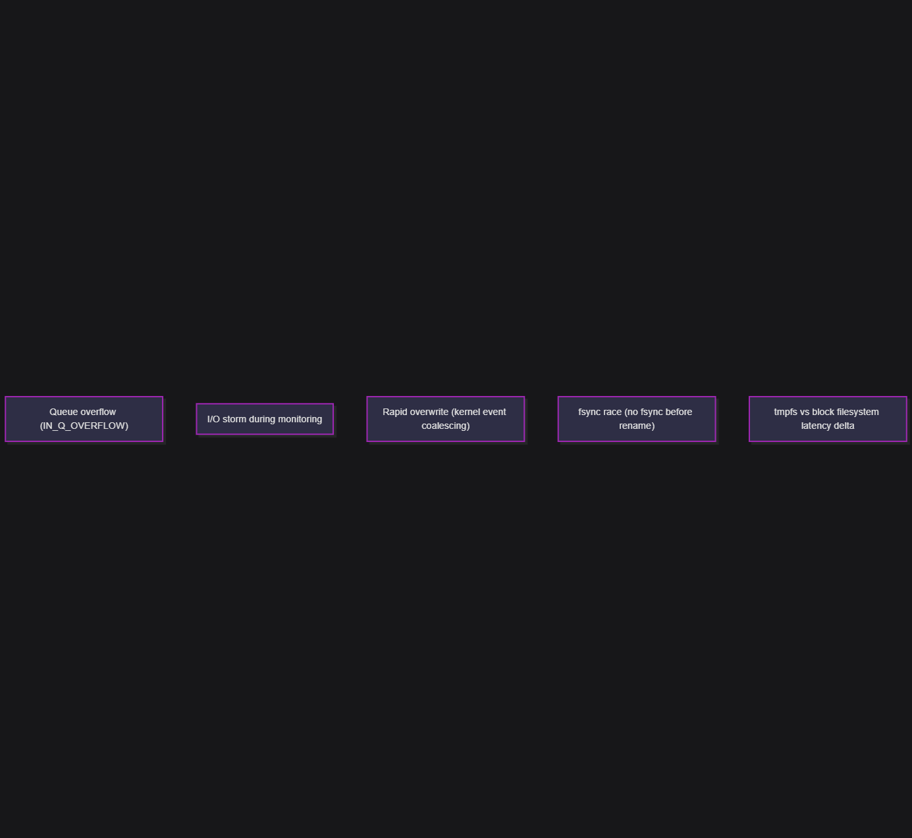

# IPC You Might Not Need

**Empirical benchmarks that measure whether your embedded Linux system actually
needs an IPC layer — or if simpler patterns already work.**

[](LICENSE)
[](https://go.dev/)
[-orange.svg)]()

---

Most embedded teams reach for sockets, D-Bus, or a message broker the moment two
processes need to talk. This toolkit lets you **measure the alternatives first**
on your actual target hardware, so the architecture decision is driven by data
instead of assumptions.

Four integration patterns, tested head-to-head:

| # | Pattern | What It Proves |
|---|---|---|
| 1 | **SQLite WAL mode** | Whether two processes can safely share one database file — no middleware needed |
| 2 | **inotify sentinel files** | Whether filesystem notifications deliver sub-millisecond config signaling |
| 3 | **Unix domain sockets** | The latency floor for explicit IPC, and whether the added complexity is worth it |
| 4 | **Shared memory (mmap + FIFO)** | The absolute floor for cross-process latency on your hardware |

> **On a Cortex-A7 (STM32MP157):** WAL mode produced zero SQLITE_BUSY events at 330 writes/sec.
> inotify delivered config notifications in 0.92 ms (median). Sockets were 2.4x faster in raw
> latency — but at human-driven config rates, the difference is noise. The IPC layer was overhead
> we didn't need. [Full example report →](example/EXAMPLE-REPORT.md)

---

## Who Is This For

Teams building embedded Linux systems where:

- **Multiple processes share a SQLite database** — a C firmware process writes sensor data,
  a Go/Python/Node service reads it for a web UI or API
- **Configuration changes must propagate between processes** — a web UI pushes settings
  that firmware must pick up within milliseconds
- **You need to decide** whether to share the database file directly (WAL mode) or add
  an IPC layer (sockets, D-Bus, shared memory)
- **You want to stress-test inotify** before relying on it — queue overflow, event
  coalescing, fsync races, tmpfs vs block device

## What You Get

| Question | Benchmark | Key Metric |
|---|---|---|
| Can two processes safely share a SQLite DB? | WAL | `sqlite_busy_count` (zero = safe) |
| At what write rate does contention appear? | WAL (escalating rates) | Threshold where BUSY > 0 |
| WAL vs rollback journal — how much faster? | WAL (both modes) | p99 latency comparison |
| Does WAL file grow unbounded? | WAL monitor | WAL size over 10 min sustained run |
| How fast are inotify config notifications? | inotify | Dispatch latency p99 (ns) |
| inotify vs sockets vs shm — which wins? | All three, same payload | Side-by-side latency |
| What is the latency floor for config delivery? | Shared memory | Pipeline latency p50/p99 (ns) |
| Does inotify lose events under load? | inotify reliability (5 scenarios) | Overflow count, coalesced events |
| Does system load degrade these numbers? | Stress test phase | Clean vs stressed percentiles |

---

## Quick Start

### Build

```bash
# Docker (recommended — no toolchain setup)
docker build -t bench-build .
docker run --rm -v $(pwd):/work bench-build

# Or with your cross-compiler
./setup.sh
make all CC=arm-linux-gnueabihf-gcc

# Native x86 build (for development)
make native
```

### Deploy

```bash
./deploy.sh 192.168.1.100                  # default: /tmp/benchmark, user root
# or
make deploy TARGET_IP=192.168.1.100
```

### Run

```bash
ssh root@192.168.1.100
cd /tmp/benchmark

# Option A: YAML-driven (recommended)
./bench run bench.yaml                     # all benchmarks from config
./bench run bench.yaml --only wal          # just WAL scenarios

# Option B: Shell scripts
./run_all.sh 60                            # full suite, 60s per scenario
./run_wal_benchmark.sh 30                  # individual benchmark
./run_inotify_benchmark.sh 30
./run_ipc_benchmark.sh 30
./run_shm_benchmark.sh 30
```

### Collect & Report

```bash
# From build host
./collect_results.sh 192.168.1.100

# Generate verdict-first report
./build/bench report results/ --config bench.yaml -o BENCHMARK-REPORT.md

# Or Python (no Go needed)
python3 generate_report.py results/ > BENCHMARK-REPORT.md
```

The report opens with a pass/fail scorecard against your thresholds, followed by
detailed latency tables and architecture guidance.

---

## Architecture

Four benchmarks share identical payloads, config parsing, and measurement methodology
so latency differences reflect **only** the transport mechanism.

### WAL: Can multiple processes share one SQLite DB?



### inotify: File-based config notification



### IPC: Socket-based notification (comparison baseline)



### SHM: mmap + FIFO (latency floor)



### inotify Reliability: 5 failure-mode stress tests



All benchmark paths run on **tmpfs** (`/tmp`). No writes hit flash storage.

> For measurement methodology details — clock selection, percentile computation,
> ARM memory ordering, struct layout — see [ARCHITECTURE.md](ARCHITECTURE.md).

---

## Customizing for Your Project

### Database Schema

Replace `schema.sql` with your application's `CREATE TABLE` statements. The
benchmark introspects column names and types to auto-generate parameterized
INSERT/SELECT statements and deterministic test data.

### Subsystem Configuration

With `bench.yaml`, define your config domains and their field schemas:

```yaml
subsystems:
  - name: sensor_calibration
    fields:
      - { name: direction, type: int, min: 0, max: 1 }
      - { name: angle_mode, type: int, min: 0, max: 1 }
  - name: network_config
    fields:
      - { name: ssid, type: text, values: [Net_A, Net_B] }
```

Without `bench.yaml`, built-in defaults are used: `sensor_calibration`,
`network_config`, `user_profiles` with ~200–350 byte payloads.

### Thresholds

Set pass/fail criteria in `bench.yaml` for automated verdict generation:

```yaml
thresholds:
  wal:
    max_busy_pct: 1.0
    max_p99_write_latency_us: 50000
  events:
    max_p99_dispatch_latency_us: 5000
    max_missed_events_pct: 0.0
```

See [bench.example.yaml](bench.example.yaml) for all options or
[bench.minimal.yaml](bench.minimal.yaml) for a minimal starting point.

---

## Output Format

Every benchmark program produces one JSON object to stdout. All progress and
debug messages go to stderr. This separation is load-bearing — the orchestrator
pipes stdout directly to `.json` files.

```json
{
  "role": "c_writer",
  "journal_mode": "wal",
  "total_writes": 1998,
  "successful_writes": 1998,
  "sqlite_busy_count": 0,
  "write_latency_us": {
    "min": 42,
    "p50": 156,
    "p95": 523,
    "p99": 1247,
    "max": 3891
  }
}
```

All numeric values are integers. Units are encoded in field names (`_us`, `_ns`,
`_bytes`, `_count`). Schema is additive-only — fields are never removed.

---

## Decision Framework

See [INTEGRATION-GUIDE.md](INTEGRATION-GUIDE.md) for a complete decision tree
based on your benchmark results, including implementation estimates.

See [THROUGHPUT-GUIDE.md](THROUGHPUT-GUIDE.md) for throughput-based buckets that
tell you when inotify stops being deterministic and you need to graduate to
sockets or shared memory — especially for hot paths that can't be decoupled.

See [CI-INTEGRATION.md](CI-INTEGRATION.md) for using this toolkit as a
CI pipeline gate — reusable GitHub Action, Docker-based steps, and
`bench report --gate` for threshold enforcement.

**Quick heuristic:**

| Your Situation | Recommendation |
|---|---|
| `sqlite_busy_count` = 0 at your throughput | WAL mode is sufficient — no IPC needed for DB |
| inotify p99 < 1 ms, zero missed events | Sentinel files work for config signaling |
| inotify reliability tests show overflows | Do NOT rely on inotify for critical config delivery |
| Need guaranteed < 100 µs notification | Use shared memory (mmap + FIFO) |
| Multiple writers causing BUSY under stress | Add application-level coordination or switch to IPC |
| WAL file grows unbounded | Enable `wal_autocheckpoint` or periodic checkpointing |

---

## Project Structure

```
├── README.md                      This file
├── ARCHITECTURE.md                Measurement methodology & clock selection rationale
├── INTEGRATION-GUIDE.md           Post-benchmark decision framework
├── THROUGHPUT-GUIDE.md            When to graduate from inotify (throughput buckets)
├── CI-INTEGRATION.md             CI pipeline integration (GitHub Action + Docker)
├── LICENSE                        MIT
├── Dockerfile                     Cross-compilation build environment
├── Makefile                       Build system (cross + native targets)
├── setup.sh                       Download SQLite amalgamation for local builds
├── deploy.sh                      scp binaries + scripts to target
├── collect_results.sh             Pull results back to build host
├── schema.sql                     Database schema (replace with yours)
├── bench.example.yaml             Full configuration reference
├── bench.minimal.yaml             Minimal config (schema + thresholds)
├── generate_report.py             Python report generator
│
├── benchmark/
│   ├── run_all.sh                 Master orchestrator
│   ├── bench/                     bench CLI (run / report / init)
│   ├── common/                    Shared C headers
│   │   ├── latency.h              Latency array + floor-index percentile
│   │   ├── subsystem.h            Config parsing + dispatch registry
│   │   └── bench_runtime.h        Runtime JSON config loader (C)
│   ├── internal/                  Shared Go packages
│   │   ├── config/                bench.yaml parser
│   │   ├── schema/                SQL schema introspection
│   │   ├── payload/               Deterministic data generation
│   │   ├── stats/                 Latency percentile computation
│   │   ├── runtime/               Runtime JSON config loader (Go)
│   │   └── report/                Verdict-first report generator
│   ├── wal/                       SQLite WAL contention benchmark
│   ├── inotify/                   Sentinel file notification benchmark
│   ├── ipc/                       Unix domain socket benchmark
│   ├── shm/                       Shared memory (mmap + FIFO) benchmark
│   └── report/cmd/                Legacy JSON → Markdown report generator
│
├── example/
│   ├── EXAMPLE-REPORT.md          Sample report from Cortex-A7 hardware
│   └── results/                   Raw JSON results backing the example report
│
└── build/                         Cross-compiled binaries (gitignored)
```

---

## Requirements

**Build host:**
- Docker, **or** GCC cross-compiler (`arm-linux-gnueabihf-gcc`) + Go 1.25+

**Target:**
- Any Linux system — kernel 2.6.13+ (inotify), tmpfs available
- ~50 MB disk, ~64 MB RAM minimum

---

## Contributing

See [CONTRIBUTING.md](CONTRIBUTING.md) for guidelines on measurement integrity,
cross-compilation, and JSON schema stability.

## License

[MIT](LICENSE)
